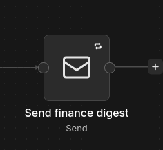

# Supreme ERP | Your enterprise solution bussiness

## Requirements:
1. Git 
2. GitHub account, or fork this repository and transfer it to your another Git provider
3. Docker
4. Midtrans account for the payment gateway
5. An SMTP email account for n8n SMTP configuration

## How to install

Clone the repository and initialize its submodules:

```bash
git clone https://github.com/shiplightstudio-cmd/supreme-erp
cd supreme-erp
git submodule update --init --recursive
```

To work with the latest `main` branch in every submodule, also run:

```bash
git submodule foreach --recursive 'git checkout main && git pull origin main'
```


## Environment Setup 

First we need to setup **.env** per each project. I suggest you to copy the **.env** value from mine below for faster & easier first setup. you can configure your own & change the value later. Also I suggest you to open an editor for easier editing.

### My .env Local Setup Link: 
https://drive.google.com/drive/folders/1ZRK35fRzK6zJr47IjDDgqUpOlBWJhju5?usp=sharing

> OPEN PER REPO
### 1. supreme-erp (ROOT)
* Copy the **.env.example** & rename it to **.env**. Then replace the value inside.

### 2. supreme-erp-be
* Copy the **.env.example** & rename it to **.env**. Then replace the value inside.
* If you use **MIDTRANS** value from my sandbox, the payment gateway data will be on my midtrans sandbox account, replace with yours if you want it on your account.
* **AUTOMATION_REPORT_TO_EMAIL** is the email you need to set for the receiver of daily income report automation n8n. if you use mine the report data will be sent to my email: shiplightstudio@gmail.com
* **SKIP_MIDTRANS_PAYMENT_VERIFICATON** is enabled by default because you need a live server with https if you want notification websocket such as payment successfull. if you already configured yours. preferable to set the value to false and set the **MIDTRANS_NOTIFICATION_URL** for the midtrans event listener websocket. The current setup payment after user success purchasing is it will automatically treat the payment success. without waiting the **MIDTRANS_NOTIFICATION_URL**.

### 3. supreme-erp-fe
* Just copy the **.env.example** & rename it to **.env**

### 4. supreme-erp-accounting
* Just copy the **.env.example** & rename it to **.env**

### 5. supreme-erp-storefront
* Copy the **.env.example** & rename it to **.env**, Then replace the value inside.
* Note the **VITE_MIDTRANS_CLIENT_KEY** should be the same as the **MIDTRANS_CLIENT_KEY** on the supreme-erp-be

### 6. supreme-erp-n8n
* Copy the .env.example & rename it to .env, Then replace the value inside.
* note the **AUTOMATION_REPORT_SECRET** should be the same **AUTOMATION_REPORT_SECRET** on the supreme-erp-be for the authentication

After all **.env** setup is done, continue to docker build setup

## DOCKER BUILD
1. Run command: docker compose up --build -d it will take a while
2. Check the running container: docker compose ps or in Docker Desktop
3. Check this url for testing the app:
    - Supreme ERP: http://localhost:3000
    - Supreme ERP Front Store: http://localhost:3001
    - Supreme ERP Accounting: http://localhost:3002
    - Supreme ERP Backend: http://localhost:5000
    - Supreme ERP N8N: http://localhost:5678/

## Database Setup
1. The migrations DB file automatically runs after the supreme-erp-be image build finished.
2. run the seeds file for data show purposes: docker compose run --rm backend npm run db:seed
3. If you want to clear the data seed use this command: 
    ```sh 
    docker compose exec -T mysql sh -c 'mysql -u root -p"$MYSQL_ROOT_PASSWORD" "$MYSQL_DATABASE"' < supreme-erp-be/scripts/clear_seed_data.sql
    ```

## Midtrans Payment Gateway Setup
* If you use my sandbox Client & Server key, it will be sent to my data, if you want to use yours, replace the: <b>MIDTRANS_SERVER_KEY, MIDTRANS_CLIENT_KEY,MIDTRANS_IS_PRODUCTION, MIDTRANS_SNAP_URL, MIDTRANS_NOTIFICATION_URL, SKIP_MIDTRANS_PAYMENT_VERIFICATON </b>
from <b>supreme-erp-be</b> with yours.
* Replace <b>VITE_MIDTRANS_CLIENT_KEY, VITE_MIDTRANS_IS_PRODUCTION</b>
from <b>supreme-erp-storefront</b> with yours

## N8N Setup:
1. Import the workflows into the n8n service using command:
    ```sh
    #For Daily Finance Digest Workflow
    docker cp supreme-erp-n8n/workflows/daily-finance-digest.json \
      supreme-erp-n8n-1:/tmp/daily-finance-digest.json
    docker exec supreme-erp-n8n-1 \
      n8n import:workflow --input=/tmp/daily-finance-digest.json

    #For Get Finance Digest Workflow
    docker cp supreme-erp-n8n/workflows/get-finance-digest.json \
      supreme-erp-n8n-1:/tmp/get-finance-digest.json
    docker exec supreme-erp-n8n-1 \
      n8n import:workflow --input=/tmp/get-finance-digest.json
    ```
2. Open: http://localhost:5678/assistant
3. Setup your local account if it's the first time
4. Open either workflow, and click on the node Send Email

    

5. Double click and click edit on Credentials > SMTP Account
6. Fill the SMTP email setup with yours as this is the sender address for the daily report later

***Note:** If the email later is not received on the mail you set on AUTOMATION_REPORT_TO_EMAIL, Check the <b>Spam</b> section on the email.

*This is the last installation step. after this you can use the app as it supposed to be*
***
<br>

## Default Administrator Account
This user account is automatically created when you build the app.

Enter the **Supreme ERP** or **Supreme ERP Accounting** with default created account
- Email: **admin@email.com**
- Password: **admin**

## Midtrans card payment testing:
Use these Sandbox card numbers when testing card payment:
| Success cards | Decline cards |
| --- | --- |
| Visa: `4811 1111 1111 1114` | Visa: `4811 1111 1111 1114` |
| Mastercard: `5211 1111 1111 1117` | Mastercard: `5111 1111 1111 1118` |

**EXP Date**: 12/28

**CVV**: 123
***
<br>

## A Brief Of The Supreme ERP App 
Supreme ERP is an ERP system module based that is focusing for a Bike manufacture company. Rather than prompting to AI, I fork the open source code for the ERP system based on: https://github.com/Talos10/SOEN390-team-9. And after that i recreated the system as the needed. 


For now the ERP has 5 module main:
1. Supreme ERP: the main module for produce inventory bike item
2. Supreme ERP Storefront: an application for user to buy good finished product
3. Supreme ERP Accounting: an applicaiton for analyze, see sales, income, etc.
4. Supreme ERP N8N: an automation server for multi purpose the system need
5. Supreme BE: the backend server for all the request coming from Front end and Read / Write to the Database
## Documentation

Architecture, technology, and module diagrams are available in [docs](./docs):

| Guide | Diagram |
| --- | --- |
| System architecture | [Supreme ERP architecture](./docs/Supreme%20ERP%20Architecture.jpg) |
| Technology stack | [Technology overview](./docs/Techtacks.jpg) |
| ERP | [Production and inventory](./docs/modules/ERP%20Supreme.jpg) |
| Storefront | [Storefront module](./docs/modules/Store%20Front%20Module.jpg) |
| Accounting | [Accounting module](./docs/modules/ERP%20Accounting.jpg) |
| Backend | [Backend module](./docs/modules/ERP%20Backend.jpg) |
| n8n | [Automation module](./docs/modules/ERP%20N8N.jpg) |


<br>
Thank you

**Created by**: Ovie Revaldi